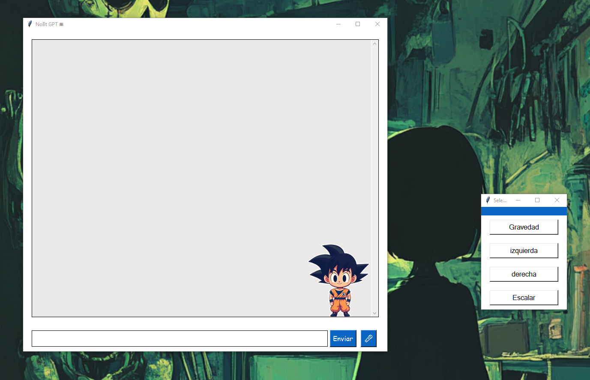

<h1 align="center">👋 SeliNa Python</h1>

<h3 aling="center">Un chat gpt dentro de un avatar3d con animaciones y mucho más.</h3>
 

---

<h3>🔨 👦 About Me :</h3>
 

 💻 RuXx .

<h3>🔨 Languages and Tools:</h3>
 

&nbsp;
&nbsp;
&nbsp;
&nbsp;
&nbsp;
&nbsp;
&nbsp;
&nbsp;
&nbsp;
&nbsp;
&nbsp;

## CMD
ctrl + q  ------> cerrar aplicación
kiv para moviles y tablet ( tactil )
historia, ver historial, abrir historia ---> para ver los ultimos 10 prompt

## PALABRAS CLAVE

 # bd_python
- que es python y para que se utiliza?
- como instalar python en windows?
- fundamentos de python
- tipos de datos basicos
- enteros
- int
- float
- numeros complejos
- complex
- cadena de texto
- str
- boolean
- listas
- set
- diccionarios
- operadores aritmeticos
- operadores logicos
- operadores de comparacion
- operadores de asignacion
- estructuras de control
- condicionales
- if
- for
- while
- continue
- pass
- break
- funcion python
- palindromo
- calculadora
- manejo de excepciones
- multiples excepciones
- excepciones anidadas
- finally
- else
- POO
- herencia
- polimorfismo
- abstraccion
- django
- flask
- spring boot
- modulo
- iterador
- decoradores
- context managers
- metaclase
- GIL
- gestion de memoria
- protocolo
- pytest
- unittest
- debugging
- logging
- flake8
- black
- Mypy
- isort
- gestor de dependencias
- packaging
- documentacion
- fastAPI
- sqlalchemy
- alembic
- OAuth2
- JWT
- graphQL
- postgresql
- mysql
- mongodb
- redis
- conexiones asincronas
- asyncpg
- aiomysql
- caching
- patrones de diseño
- singleton
- factory
- Observer
- strategy
- solid
- microservicios
- ejercicio1
- ejercicio2
- ejercicio3
- ejercicio4
- ejercicio5
- ejercicio6
- ejercicio7
- ejercicio8
- ejercicio9
- ejercicio10
- ejercicio11
- ejercicio12
- ejercicio13
- ejercicio14
- ejercicio15
- arquitectura
- rabbitmq
- kafka
- cqrs
- event sourcing
- docker
- aws
- gcp
- azure
- github actions
- gitlab
- jenkins
- nginx
- gunicorn
- uwsgi
- ejercicio16
- ejercicio17
- ejercicio18
- ejercicio19
- ejercicio20
- ejercicio21
- ejercicio22
- ejercicio23
- ejercicio24
- ejercicio25
- ejercicio26
- ejercicio27
- ejercicio28
- ejercicio29
- ejercicio30
- ejercicio31
- ejercicio32
- ejercicio33
- ejercicio34
- ejercicio35

me queda por documentar : {

Servidores web: Nginx, Gunicorn, uWSGI.

Monitorización: Prometheus, Grafana, Sentry.

Infra as Code: Terraform, CloudFormation.

8. Seguridad
OWASP Top 10: Prevención de SQLi, XSS, CSRF, etc.

Hardening: Configuración segura de servidores y aplicaciones.

Criptografía: Uso de bcrypt, cryptography.

Auditorías: Herramientas como Bandit para análisis estático.

9. Habilidades Blandas
Trabajo en equipo: Uso de metodologías ágiles (Scrum, Kanban).

Mentoría: Guiar a desarrolladores junior.

Comunicación: Explicar ideas técnicas a no técnicos.

Gestión de tiempo: Priorización de tareas complejas.

10. Extra (Dependiendo del enfoque)
Data Science: Pandas, NumPy, Matplotlib.

Machine Learning: Scikit-learn, TensorFlow, PyTorch.

Automatización: Scripts con click o argparse.

Web Scraping: BeautifulSoup, Scrapy, Selenium.

}

