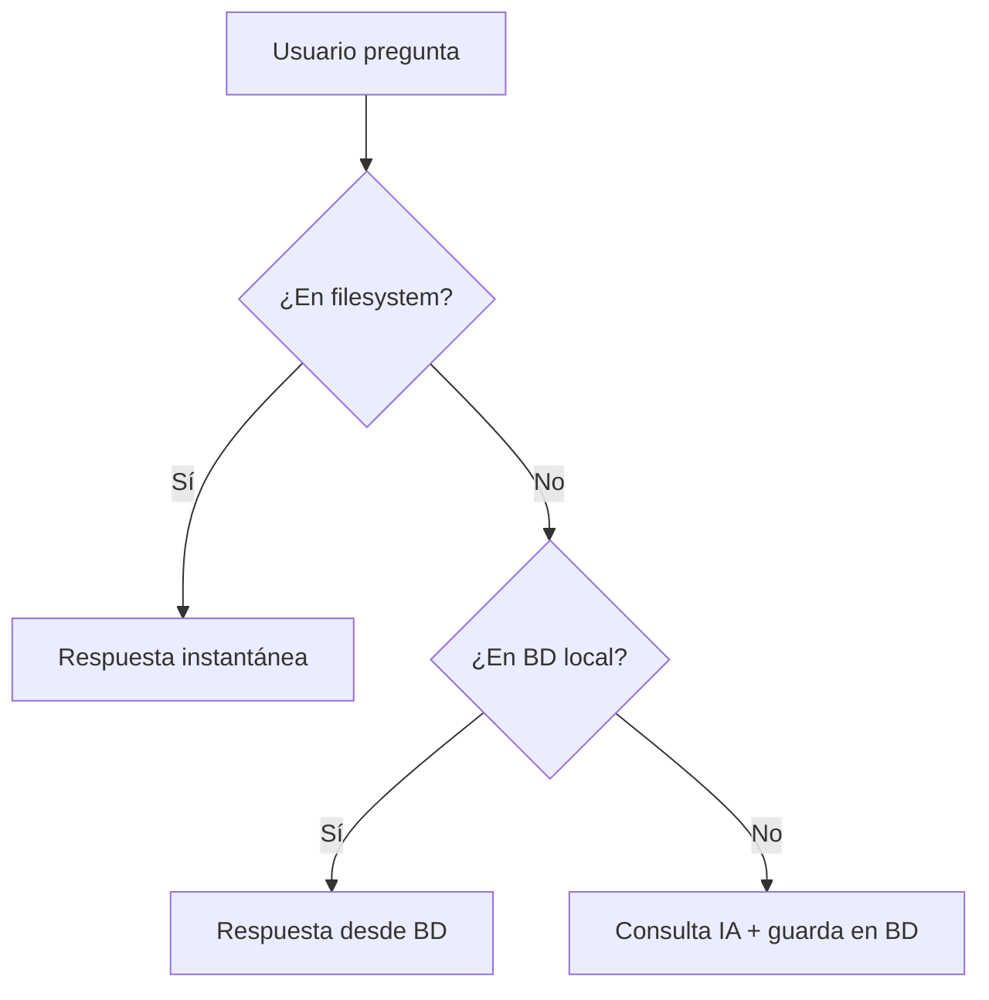

# Selina IA - Asistente Virtual Inteligente

<div align="center">
  
  <h3>🎤 Asistente Virtual con Control por Voz y Gestión de Tareas</h3>
  <p><em>Un asistente inteligente con interfaz gráfica y control por voz completo</em></p>
</div>

## 📋 Tabla de Contenidos

- [🚀 Características Principales](#-características-principales)
- [💻 Tecnologías Utilizadas](#-tecnologías-utilizadas)
- [📦 Instalación y Configuración](#-instalación-y-configuración)
- [🎯 Guía de Uso](#-guía-de-uso)
- [🎤 Comandos de Voz](#-comandos-de-voz)
- [📅 Gestión de Tareas](#-gestión-de-tareas)
- [🖥️ Control de Aplicaciones](#️-control-de-aplicaciones)
- [🔧 Herramientas MCP](#-herramientas-mcp)
- [🛠️ Desarrollo y Contribución](#️-desarrollo-y-contribución)
- [📄 Licencia](#-licencia)
- [👨‍💻 Autor](#-autor)

## 🚀 Características Principales

### 🎤 Control por Voz Avanzado
- **Reconocimiento de voz en español** con Google Speech Recognition
- **Procesamiento de comandos naturales** con múltiples alternativas
- **Feedback de voz** con síntesis de texto a voz (TTS)
- **Estados de conversación** para comandos multi-paso

### 💬 Interfaz Gráfica Moderna
- **Avatar 3D animado** con múltiples estados y animaciones
- **Chat dinámico** con formato de texto enriquecido
- **Historial de conversaciones** persistente
- **Interfaz táctil** optimizada para móviles y tablets

### 📅 Gestión Completa de Tareas
- **Agregar tareas por voz** con fechas y horarios
- **Consultar tareas pendientes/completadas**
- **Marcar tareas como completadas**
- **Base de datos SQLite** para persistencia

### 🖥️ Control de Sistema Completo
- **Abrir/cerrar aplicaciones** del sistema
- **Control de volumen** del sistema
- **Gestión de carpetas** del usuario
- **Acceso a sitios web** conocidos
- **Sistema de archivos** completo

### 🔧 Arquitectura Robusta
- **Sistema TTS thread-safe** con colas de mensajes
- **Manejo de errores** con múltiples fallbacks
- **Base de datos vectorial** para embeddings
- **Sistema MCP** para herramientas especializadas

## 💻 Tecnologías Utilizadas

<div align="center">

### 🎯 Core Technologies
| Tecnología | Versión | Propósito |
|------------|---------|-----------|
|  **Python** | 3.8+ | Lenguaje principal |
|  **SQLite** | 3.x | Base de datos local |
|  **Tkinter** | - | Interfaz gráfica |
|  **OpenCV** | 4.x | Procesamiento de imágenes |

### 🎤 Voice & Audio
| Tecnología | Propósito |
|------------|-----------|
| **SpeechRecognition** | Reconocimiento de voz |
| **pyttsx3** | Síntesis de voz (TTS) |
| **pycaw** | Control de audio de Windows |
| **pygame** | Reproducción de sonidos |

### 🤖 AI & ML
| Tecnología | Propósito |
|------------|-----------|
| **FAISS** | Búsqueda vectorial |
| **Sentence Transformers** | Embeddings de texto |
| **SQLite Vector** | Base de datos vectorial |

### 🔧 System Integration
| Tecnología | Propósito |
|------------|-----------|
| **pyautogui** | Automatización de interfaz |
| **keyboard** | Control de teclado |
| **subprocess** | Ejecución de comandos del sistema |
| **threading** | Procesamiento concurrente |

</div>

## 📦 Instalación y Configuración

### Requisitos del Sistema
- **SO**: Windows 10/11
- **Python**: 3.8 o superior
- **RAM**: 4GB mínimo
- **Espacio**: 500MB disponible

### Instalación

1. **Clonar el repositorio**
   ```bash
   git clone https://github.com/RuXx/selina-ia.git
   cd selina-ia
   ```

2. **Crear entorno virtual**
   ```bash
   python -m venv venv
   .\venv\Scripts\activate  # Windows
   ```

3. **Instalar dependencias**
   ```bash
   pip install -r requirements.txt
   ```

4. **Configurar base de datos**
   ```bash
   python -c "from core.database import init_db; init_db()"
   ```

5. **Ejecutar la aplicación**
   ```bash
   python selina_ia/main.py
   ```

### Configuración Inicial

Edita `selina_ia/config/settings.py` para personalizar:
- **Umbrales de voz** para mejor reconocimiento
- **Rutas de archivos** y aplicaciones
- **Sitios web** favoritos
- **Configuración de audio**

## 🎯 Guía de Uso

### Inicio Rápido

1. **Ejecuta** `python selina_ia/main.py`
2. **Haz doble clic** en el avatar de Selina
3. **Presiona el botón** 🎤 para activar voz
4. **Di comandos** naturales en español

### Interfaz Principal

- **Avatar animado**: Haz doble clic para abrir chat
- **Botón micrófono**: Activa/desactiva reconocimiento de voz
- **Área de chat**: Conversaciones con formato enriquecido
- **Historial**: Accede a conversaciones anteriores

### Atajos de Teclado
- **Ctrl + Q**: Cerrar aplicación
- **Ctrl + C**: Abrir calendario de tareas
- **Doble clic**: Abrir interfaz de chat

## 🎤 Comandos de Voz

Selina IA responde a comandos naturales en español. Di "Selina" seguido de tu comando.

### 🗂️ Gestión de Carpetas
```bash
"abre carpeta documentos"    # Abre Documentos
"abre carpeta descargas"     # Abre Descargas
"abre carpeta imágenes"      # Abre Imágenes
"abre carpeta vídeos"        # Abre Vídeos
"abre carpeta música"        # Abre Música
"abre carpeta escritorio"    # Abre Escritorio
"abre carpeta raíz"          # Abre C:\
"abre carpeta sistema"       # Abre C:\Windows\System32
"abre carpeta temp"          # Abre carpeta temporal
```

### 🖥️ Aplicaciones del Sistema
```bash
"abre calculadora"           # Calculadora
"abre paint"                 # Paint
"abre word"                  # Microsoft Word
"abre excel"                 # Microsoft Excel
"abre powerpoint"            # Microsoft PowerPoint
"abre vscode"                # Visual Studio Code
"abre terminal"              # Command Prompt
"abre configuración"         # Configuración de Windows
"abre explorador"            # Explorador de archivos
```

### 🌐 Navegadores y Web
```bash
"abre chrome"                # Google Chrome
"abre firefox"               # Mozilla Firefox
"abre edge"                  # Microsoft Edge
"abre google"                # Buscar en Google
"cerrar web"                 # Cierra Chrome
```

### 🎵 Entretenimiento
```bash
"reproduce [canción]"        # Busca en YouTube
"alarma"                     # Configura alarma
"detener"                    # Detiene alarma activa
```

### 🔍 Búsqueda e Información
```bash
"busca [tema]"              # Busca en Wikipedia
```

### ✍️ Productividad
```bash
"escribe"                   # Toma nota por voz
"tarea agregar [título]"    # Agrega nueva tarea
"qué tareas tengo hoy"      # Consulta tareas del día
"marcar tarea [título] como completada"  # Completa tarea
```

### 🔧 Sistema
```bash
"sube el volumen"           # Aumenta volumen
"baja volumen"              # Reduce volumen
"mute"                      # Silencia audio
"apagar"                    # Apaga sistema (confirma)
"reiniciar"                 # Reinicia sistema (confirma)
```

### 🚪 Control de Aplicaciones
```bash
"cierra word"               # Cierra Microsoft Word
"cierra chrome"             # Cierra Google Chrome
"cierra calculadora"        # Cierra Calculadora
"cierra vscode"             # Cierra VS Code
# ... y muchas más aplicaciones
```

## 📅 Gestión de Tareas

### Agregar Tareas
```bash
Di: "tarea agregar comprar leche"
Di: "tarea agregar reunión con cliente mañana"
Di: "tarea agregar proyecto deadline viernes"
```

### Consultar Tareas
```bash
Di: "qué tareas tengo hoy"
Di: "qué tareas tengo mañana"
Di: "qué tareas tengo"
```

### Completar Tareas
```bash
Di: "marcar tarea comprar leche como completada"
Di: "marcar tarea reunión con cliente como completada"
```

### Características
- ✅ **Base de datos persistente** (SQLite)
- 📅 **Fechas y horarios** opcionales
- 🏷️ **Categorización** automática
- 📊 **Estados**: pendiente/completada
- 🔄 **Sincronización** en tiempo real

## 🖥️ Control de Aplicaciones

### Abrir Aplicaciones
Selina puede abrir más de **50 aplicaciones** del sistema:

**Desarrollo:**
- VS Code, Visual Studio, Android Studio, Eclipse
- Terminal, PowerShell, Git Bash

**Oficina:**
- Word, Excel, PowerPoint, Outlook
- Teams, OneNote, Access

**Multimedia:**
- Spotify, VLC, Windows Media Player
- Fotos, Paint 3D

**Sistema:**
- Calculadora, Explorador de archivos
- Configuración, Panel de control

### Cerrar Aplicaciones
Comando simétrico para cerrar aplicaciones:
```bash
"cierra [aplicación]"  # Cierra la aplicación específica
```

### Gestión Inteligente
- 🔍 **Detección automática** de apps vs sitios web
- ⚡ **Múltiples métodos** de apertura (directo, start, subprocess)
- 🛡️ **Manejo de errores** robusto
- 📊 **Feedback de voz** en tiempo real


## 🔧 Herramientas MCP

Selina IA incluye un sistema avanzado de **Herramientas MCP** (Model Context Protocol) que permite interactuar con el sistema de archivos, bases de datos y herramientas especializadas.

### Acceso a Herramientas

1. **Abrir chat**: Doble clic en el avatar
2. **Ver herramientas**: Escribe `/mcp help`
3. **Sintaxis moderna**: Comandos naturales en español

### 🗄️ Herramientas de Base de Datos

#### Análisis de Código
```bash
/mcp analizar def suma(a, b): return a + b
```
- ✅ Explica qué hace el código
- 🔍 Detecta errores potenciales
- 💡 Sugiere mejoras

#### Explicación de Conceptos
```bash
/mcp explicar listas en Python
/mcp explicar funciones lambda
```
- 📚 Definiciones claras
- 💡 Ejemplos prácticos
- 🎯 Casos de uso

#### Debugging de Código
```bash
/mcp debug print(10/0): ZeroDivisionError
```
- 🔎 Identifica causas de errores
- 🛠️ Proporciona soluciones
- ✅ Muestra código corregido

### 📁 Herramientas de Sistema de Archivos

#### Gestión de Archivos
```bash
/mcp leer C:\Users\RuXx\Desktop\script.py
/mcp listar C:\Users\RuXx\Documents
/mcp buscar .pdf en C:\Users\RuXx\Downloads
/mcp info C:\Users\RuXx\Desktop\archivo.txt
```

#### Operaciones de Archivos
```bash
/mcp mover origen destino
```
- 📋 Leer contenido de archivos
- 📂 Listar directorios
- 🔍 Buscar archivos por extensión
- ℹ️ Obtener información detallada
- 📦 Mover/renombrar archivos


### ⚡ Arquitectura de Rendimiento

Selina IA utiliza un **sistema de tres niveles** para máxima eficiencia:

1. **Filesystem** 🚀 - Respuestas instantáneas
2. **Base de Datos** 🗄️ - Búsqueda en SQLite local
3. **IA** 🤖 - Solo cuando es necesario

### 🔄 Flujo de Trabajo Típico


```mermaid
graph TD
    A[Usuario pregunta] --> B{¿En filesystem?}
    B -->|Sí| C[Respuesta instantánea]
    B -->|No| D{¿En BD local?}
    D -->|Sí| E[Respuesta desde BD]
    D -->|No| F[Consulta IA + guarda en BD]
```
3. **IA** 🤖 - Solo cuando es necesario

### 📊 Base de Datos Vectorial

- **Embeddings semánticos** para búsquedas inteligentes
- **FAISS** para indexación vectorial rápida
- **Historial persistente** de conversaciones
- **Aprendizaje continuo** del usuario

### 🔄 Flujo de Trabajo Típico


```mermaid
graph TD
    A[Usuario pregunta] --> B{¿En filesystem?}
    B -->|Sí| C[Respuesta instantánea]
    B -->|No| D{¿En BD local?}
    D -->|Sí| E[Respuesta desde BD]
    D -->|No| F[Consulta IA + guarda en BD]
```

### Herramientas Disponibles

#### 1. 🔍 Análisis de Código
**Propósito**: Analizar y mejorar código Python.

**Sintaxis**:
```
/mcp analizar def suma(a, b): return a + b
```

**Beneficios**:
- ✅ Explica qué hace el código
- ✅ Sugiere mejoras
- ✅ Detecta errores potenciales
- ✅ Muestra versión mejorada

#### 2. 📖 Explicar Conceptos
**Propósito**: Aprender sobre temas de programación.

**Sintaxis**:
```
/mcp explicar listas
/mcp explicar bucles en Python
```

**Resultado**:
- 📚 Definición clara
- 💡 Ejemplos prácticos
- 🎯 Casos de uso
- ⚠️ Consejos importantes

#### 3. 🐛 Debuggear Código
**Propósito**: Encontrar y solucionar errores en el código.

**Sintaxis**:
```
/mcp debug print(10/0): ZeroDivisionError
/mcp debug def funcion(): pass
```

**Beneficios**:
- 🔎 Identifica la causa del error
- 🛠️ Proporciona la solución
- ✅ Muestra código corregido
- 💡 Previene errores futuros

### Ejemplos Paso a Paso para Principiantes

#### Ejemplo 1: Primer Análisis de Código
1. Copia este código:
   ```python
   def saludar(nombre):
       print("Hola " + nombre)
       return True
   ```
2. Escribe en el chat:
   ```
   /mcp analizar def saludar(nombre): print("Hola " + nombre); return True
   ```
3. Presiona Enter y obtendrás un análisis completo con sugerencias de mejora.

#### Ejemplo 2: Aprender sobre Listas
Escribe en el chat:
```
/mcp explicar listas
```
Obtendrás una explicación completa sobre el uso de listas en Python.

#### Ejemplo 3: Solucionar un Error Común
1. Si tienes este código con error:
   ```python
   edad = input("¿Cuántos años tienes? ")
   if edad > 18:
       print("Eres mayor de edad")
   ```
2. Escribe en el chat:
   ```
   /mcp debug edad = input("¿Cuántos años tienes? "); if edad > 18: print("Eres mayor de edad"): TypeError
   ```
3. Obtendrás la solución del error y explicación de su causa.

### Consejos para Usuarios

#### 📋 Formato Correcto
- Escribe comandos naturales en español
- Para código, usa una línea o separa con punto y coma
- Incluye el mensaje de error cuando debuguees
- Copia y pega los ejemplos exactamente como están

#### 🔄 Si Cometes un Error
No te preocupes, la aplicación indicará qué salió mal. Puedes intentarlo de nuevo.

#### 📚 Para Aprender Programación
Usa frecuentemente con temas como:
- `/mcp explicar variables`
- `/mcp explicar condicionales if`
- `/mcp explicar bucles for`
- `/mcp explicar funciones`
- `/mcp explicar clases y objetos`

#### 🐛 Para Resolver Problemas
Cuando tu código no funcione:
- `/mcp debug [tu código]: [mensaje de error]`
- Incluye el error exacto para mejor diagnóstico

### Preguntas Frecuentes

**¿Necesito saber programación para usar estas herramientas?**
¡No! Están diseñadas para ayudarte a aprender y resolver problemas.

**¿Puedo usar las herramientas con otros lenguajes?**
Actualmente están optimizadas para Python, pero puedes consultar conceptos generales de programación.

**¿Qué hago si el comando no funciona?**
- Verifica que hayas escrito exactamente como en los ejemplos
- Asegúrate de usar comillas dobles `"`
- Si usas código, recuerda incluir `\n` para saltos de línea

**¿Puedo guardar las respuestas?**
Sí, todas las conversaciones se guardan automáticamente en el historial.

### 🎓 Ejercicios para Practicar

**Nivel Principiante:**
- `/mcp analizar print("Hola Mundo")`
- `/mcp explicar variables`
- `/mcp debug print("5" + 3): TypeError`

**Nivel Intermedio:**
- `/mcp analizar def area_circulo(radio): return 3.14159 * radio ** 2`
- `/mcp explicar comprensión de listas`
- `/mcp debug while True: pass: KeyboardInterrupt`


### Guía Completa de Herramientas MCP

#### Introducción
Las Herramientas MCP (Model Context Protocol) permiten interactuar con la aplicación de manera eficiente, priorizando la base de datos local y utilizando IA solo cuando es necesario.

#### Herramientas de Base de Datos

##### 1. 🔍 code_analysis - Análisis de Código
**Descripción**: Analiza código Python utilizando primero la base de datos local.

**🆕 Sintaxis Nueva**:
```bash
/mcp analizar def suma(a, b): return a + b
```

**Sintaxis Antigua (JSON)**:
```bash
/mcp {"tool": "code_analysis", "arguments": {"code": "def suma(a, b):\n    return a + b"}}
```

**Respuesta esperada**:
```
## 🗄️ Desde Base de Datos

**Análisis encontrado en base de datos:**

**1. def suma(a, b): return a + b...**
Esta función suma dos números. Mejora: añadir validación de tipos. Posible error: valores no numéricos.
```

##### 2. 📖 explain_concept - Explicar Conceptos
**Descripción**: Explica conceptos de programación utilizando la base de datos local.

**🆕 Sintaxis Nueva**:
```bash
/mcp explicar listas en Python
```

**Sintaxis Antigua (JSON)**:
```bash
/mcp {"tool": "explain_concept", "arguments": {"concept": "listas en Python"}}
```

**Respuesta esperada**:
```
## 🗄️ Desde Base de Datos

**Explicaciones encontradas:**

**FAQ: listas**
Las listas en Python son colecciones ordenadas y mutables de elementos...

**Base de Datos: Explicar concepto: listas**
📚 Las listas permiten almacenar múltiples valores en una variable...
```

##### 3. 🐛 debug_code - Debuggear Código
**Descripción**: Encuentra y soluciona errores en código Python.

**🆕 Sintaxis Nueva**:
```bash
/mcp debug print(10/0): ZeroDivisionError
```

**Sintaxis Antigua (JSON)**:
```bash
/mcp {"tool": "debug_code", "arguments": {"code": "print(10/0)", "error": "ZeroDivisionError"}}
```

**Respuesta esperada**:
```
## 🗄️ Desde Base de Datos

**Soluciones de debugging encontradas:**

**1. Debug: print(10/0) - Error: ZeroDivisionError...**
Error: división por cero. Solución: validar que el divisor no sea cero antes de dividir.
```

##### 4. 🔎 search_knowledge - Búsqueda de Conocimiento
**Descripción**: Búsqueda completa en toda la base de conocimientos.

**🆕 Sintaxis Nueva**:
```bash
/mcp conocimiento decoradores
```

**Sintaxis Antigua (JSON)**:
```bash
/mcp {"tool": "search_knowledge", "arguments": {"query": "decoradores"}}
```

**Respuesta esperada**:
```
## 🔍 Resultados para: 'decoradores'

1. 📚 FAQ: decoradores
Los decoradores son funciones que modifican el comportamiento de otras funciones...

2. 💾 Base de Datos: Explicar concepto: decoradores
Los decoradores se usan con @ y pueden añadir funcionalidad como logging...
```

#### Herramientas de Filesystem

##### 5. 📄 read_file - Leer Archivos
**Descripción**: Lee el contenido de archivos locales de forma segura.

**🆕 Sintaxis Nueva**:
```bash
/mcp leer C:\Users\RuXx\Desktop\mi_script.py
```

**Sintaxis Antigua (JSON)**:
```bash
/mcp {"tool": "read_file", "arguments": {"path": "C:\\Users\\RuXx\\Desktop\\mi_script.py"}}
```

**Respuesta esperada**:
```
## 📄 Contenido de `C:\Users\RuXx\Desktop\mi_script.py`

```python
def hola_mundo():
    print("¡Hola desde mi script!")
```
```

##### 6. 📂 list_directory - Listar Directorios
**Descripción**: Lista archivos y directorios de una ruta específica.

**🆕 Sintaxis Nueva**:
```bash
/mcp listar C:\Users\RuXx\Desktop
```

**Sintaxis Antigua (JSON)**:
```bash
/mcp {"tool": "list_directory", "arguments": {"path": "C:\\Users\\RuXx\\Desktop"}}
```

**Respuesta esperada**:
```
## 📂 Contenido de `C:\Users\RuXx\Desktop`

### 📁 Directorios
📁 Proyectos/
📁 Documentos/

### 📄 Archivos
📄 mi_script.py (245 bytes)
📄 notas.txt (1024 bytes)
📄 imagen.png (2048 bytes)
```

##### 7. 🔍 search_files - Buscar Archivos
**Descripción**: Busca archivos por nombre en un directorio.

**🆕 Sintaxis Nueva**:
```bash
/mcp buscar .py en C:\Users\RuXx\Desktop
```

**Sintaxis Antigua (JSON)**:
```bash
/mcp {"tool": "search_files", "arguments": {"query": ".py", "path": "C:\\Users\\RuXx\\Desktop"}}
```

**Respuesta esperada**:
```
## 🔍 Resultados para '.py' en `C:\Users\\RuXx\\Desktop`

### 📄 Archivos
📄 mi_script.py (245 bytes)
📄 utils.py (512 bytes)
📁 Proyectos/main.py (1024 bytes)
```

##### 8. 📊 file_info - Información de Archivo
**Descripción**: Obtiene información detallada de un archivo o directorio.

**🆕 Sintaxis Nueva**:
```bash
/mcp info C:\Users\RuXx\Desktop\mi_script.py
```

**Sintaxis Antigua (JSON)**:
```bash
/mcp {"tool": "file_info", "arguments": {"path": "C:\\Users\\RuXx\\Desktop\\mi_script.py"}}
```

**Respuesta esperada**:
```
## 📊 Información de `C:\Users\\RuXx\\Desktop\\mi_script.py`

**Nombre:** mi_script.py
**Ruta completa:** C:\Users\RuXx\Desktop\mi_script.py
**Tamaño:** 245 bytes
**Modificado:** 1704067200.0
**Es archivo:** True
**Es directorio:** False
```

##### 9. 🚀 move_file - Mover Archivos
**Descripción**: Mueve o renombra archivos y directorios.

**🆕 Sintaxis Nueva**:
```bash
/mcp mover C:\Users\RuXx\Downloads\archivo.txt C:\Users\RuXx\Documents\archivo.txt
```

**Sintaxis Antigua (JSON)**:
```bash
/mcp {"tool": "move_file", "arguments": {"source": "C:\\Users\\RuXx\\Downloads\\archivo.txt", "destination": "C:\\Users\\RuXx\\Documents\\archivo.txt"}}
```

**Respuesta esperada**:
```
✅ **Archivo movido exitosamente**

**Origen:** `C:\Users\RuXx\Downloads\archivo.txt`
**Destino:** `C:\Users\RuXx\Documents\archivo.txt`
```

#### Flujo de Ejecución
**Orden de Prioridad:**
1. 📁 **Filesystem** - Respuestas instantáneas
2. 🗄️ **Base de Datos** - Búsqueda en SQLite local
3. 🤖 **IA** - Solo si no hay resultados locales

**Ejemplo del Flujo:**
```
Usuario: /mcp {"tool": "explain_concept", "arguments": {"concept": "listas"}}

→ 1. Busca en FAQs, PythonDB, History
→ 2. Si encuentra: "🗄️ Desde Base de Datos"
→ 3. Si no encuentra: "🤖 Generado por IA" + GUARDA en BD
```

#### Consejos de Uso

**Para Máxima Velocidad:**
```bash
# 🆕 Sintaxis Nueva - herramientas filesystem para operaciones rápidas
/mcp listar .
/mcp leer script.py
```

**Para Aprendizaje:**
```bash
# 🆕 Sintaxis Nueva - consulta conceptos básicos
/mcp explicar funciones
/mcp explicar bucles
```

**Para Debugging:**
```bash
# 🆕 Sintaxis Nueva - analiza y corrige código
/mcp analizar def funcion(): pass
/mcp debug print(10/0): ZeroDivisionError
```

**Para Gestión de Archivos:**
```bash
# 🆕 Sintaxis Nueva - organiza tus archivos
/mcp buscar .pdf en C:\Users\RuXx\Downloads
/mcp mover C:\Users\RuXx\Downloads\doc.pdf C:\Users\RuXx\Documents\doc.pdf
```

#### Ejemplos Prácticos Comunes

**Mover todos los PDFs de Descargas a Documentos:**
```bash
# 🆕 Sintaxis Nueva
# 1. Buscar PDFs
/mcp buscar .pdf en C:\Users\RuXx\Downloads

# 2. Mover cada archivo (repetir por cada PDF)
/mcp mover C:\Users\RuXx\Downloads\documento1.pdf C:\Users\RuXx\Documents\documento1.pdf
```

**Analizar y Mejorar un Script:**
```bash
# 🆕 Sintaxis Nueva
# 1. Leer el script
/mcp leer C:\Users\RuXx\Desktop\mi_script.py

# 2. Analizar el código
/mcp analizar [contenido_del_script]

# 3. Debuggear si hay errores
/mcp debug [codigo_con_error]: [Error específico]
```

**Aprender sobre un Concepto Nuevo:**
```bash
# 🆕 Sintaxis Nueva
# 1. Buscar explicaciones existentes
/mcp conocimiento decoradores

# 2. Obtener explicación detallada
/mcp explicar decoradores en Python
```

#### Solución de Problemas

**Error de Formato JSON:**
```bash
# ❌ Incorrecto
/mcp {'tool': 'read_file', 'arguments': {'path': 'archivo.txt'}}

# ✅ Correcto
/mcp {"tool": "read_file", "arguments": {"path": "archivo.txt"}}
```

**Error de Ruta:**
```bash
# Usa dobles barras en Windows
/mcp {"tool": "list_directory", "arguments": {"path": "C:\\Users\\RuXx\\Desktop"}}

# O barras simples
/mcp {"tool": "list_directory", "arguments": {"path": "C:/Users/RuXx/Desktop"}}
```

**Si una Herramienta No Responde:**
```bash
# Verifica todas las herramientas disponibles
/mcp help

# O específicamente
/mcp tools
```
 .\venv\Scripts\Activate.ps1


